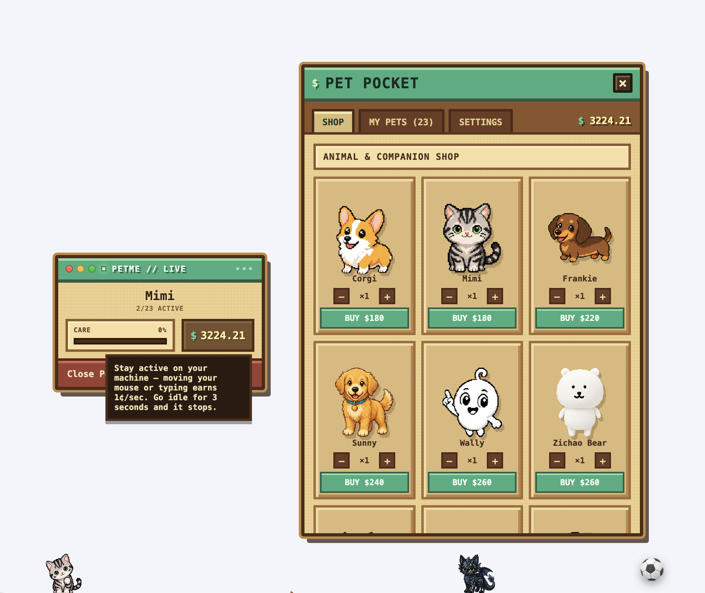

# petme

A pixel pet that lives on your desktop. It walks around, follows a ball you throw at it, needs feeding and attention, and you can grow a whole collection of them by earning in-app cash just from using your computer normally.

[](https://github.com/lothartj/petme/releases/download/v1.0.0/petme-1.0.0.dmg)
[](https://github.com/lothartj/petme/releases/download/v1.0.0/petme-1.0.0-setup.exe)



## What it actually does

- One or more pixel pets (dog, cat, dachshund, corgi, retriever, bear, cockroach, and a few anime/game cameo skins) walk, idle, sleep, and react around your screen.
- **Petting**: click a pet to pet it — its care meter goes up and hearts pop.
- **Fetch**: drag the ball icon near the food bowl and throw it. It has real physics (gravity, bounce, rolling friction) and pets will chase it across the screen and try to catch it once it's slow enough to grab.
- **Care**: each pet has a care meter that slowly decays over time (even while the app isn't running — it catches up based on real elapsed time next launch). Petting it restores care.
- **The HUD**: a small draggable panel (top-left by default) shows the active pet's name and care meter, your cash balance, and a button to open the shop. The three colored dots in its title bar work like macOS window controls — red quits the app, yellow minimizes the panel down to just its title bar, green toggles the shop.
- **The Pet Pocket (shop)**: buy new pets, choose how many of each type are actually visible on your desktop at once (My Pets tab — you can own more than you show), and adjust global pet size (Settings tab).
- **Tray icon**: petme has no Dock-only presence — it also lives in the menu bar tray for quick access when the HUD is minimized or hidden behind other windows.

## How the money works

Hover the `$` balance in the HUD or the shop for the same explanation in-app, but in short:

- You earn **1¢ (0.01) per second** while you're actively using your computer — moving the mouse or typing anywhere on the system counts, not just inside petme.
- Stop touching your mouse/keyboard for **3 seconds** and earning pauses. Come back and it resumes.
- Money is spent in the Pet Pocket shop to buy more pets. Prices range from about $120 (Cockroach) to $320 (Kaiju No. 8) — deliberately expensive, so building up a collection is a real goal, not an instant unlock.
- Buying `N` of the same pet only puts **one** on your desktop by default — the rest sit in your collection (My Pets tab) until you explicitly turn them on with the +/- stepper there and hit **Release**.
- Everything (cash, which pets you own, which are currently active, pet size setting) is saved to disk automatically and survives quitting and relaunching the app.

## Running it from source

```bash
npm install
npm run dev
```

No window opens in the traditional sense — petme is a transparent full-screen overlay. Look for the tray icon in your menu bar and use **Spawn Pet** / the HUD's "Open Pet Pocket" to get going. On macOS you'll be prompted for **Accessibility permission** the first time (System Settings → Privacy & Security → Accessibility) — that's needed for the "pet perks up when you type" reaction; without it, everything else still works, that one reaction just won't fire.

## Installing a built copy

Use the download buttons at the top of this page, or grab either file from the [latest release](https://github.com/lothartj/petme/releases/latest) directly. Both are unsigned, so:

- **macOS**: the `.dmg` is ad-hoc signed with whatever developer identity built it, not a proper Developer ID for public distribution, so Gatekeeper will block it on first try with a **"petme" Not Opened** dialog. Recent macOS versions removed the old right-click-to-open bypass, so use one of these instead:
  - **System Settings**: open System Settings → Privacy & Security → scroll down to the Security section → you'll see a note that petme was blocked → click **Open Anyway** → confirm with your password/Touch ID → try opening the app again (one more confirmation, then it's done for good).
  - **Terminal** (faster, works on every macOS version): `xattr -cr /Applications/petme.app`, then open it normally.
- **Windows**: the `-setup.exe` has no code-signing certificate, so SmartScreen will similarly warn about an unrecognized publisher on first run — click **More info → Run anyway**.

## Building the installers yourself

```bash
npm run build:mac    # -> dist/petme-<version>.dmg
npm run build:win    # -> dist/petme-<version>-setup.exe
npm run build:linux  # -> dist/petme-<version>.AppImage (and .deb/.snap)
```

These are unsigned builds (no Apple Developer ID or Windows code-signing certificate is configured) — fine for sharing with friends, but expect the Gatekeeper/SmartScreen prompts described above. `build:win` works from macOS without needing Wine installed.

## Architecture, for anyone poking at the code

- `src/main` — Electron main process: one transparent, click-through, always-on-top window per display, the tray, cursor/keystroke tracking for the money system, and the persisted store (`electron-store`).
- `src/preload` — the only bridge to the renderer, via `contextBridge`, exposing `window.petApi`.
- `src/renderer` — React + TypeScript UI: the pet sprite renderer, the physics-driven ball, the HUD, and the shop.
- `src/shared` — IPC channel names and types imported by all three layers.

```bash
npm run typecheck
npm run lint
npm run check:pet-machine   # plain assert-based check of the walk/eat/fetch/catch logic
```

## Simplifications (ceiling + upgrade path)

- **Poop decals and the thrown ball are session-only**, not persisted — everything's clean again on relaunch.
- **Keystroke reactions need Accessibility permission** on macOS; without it, `startKeystrokeTracking` just logs a warning and that one reaction never fires, no crash.
- **Pets don't migrate between displays** — a pet stays on whichever monitor it was spawned on.
- **Unsigned builds** — no code-signing certificate is set up, so both `build:mac` and `build:win` produce installers that trigger a first-run OS warning (see above). Getting rid of that requires an Apple Developer ID ($99/yr) and a Windows code-signing certificate, neither of which is set up here.

## Credits

The pixel dog/cat/etc. sprite sheets are original community submissions to the [awesome-codex-pet](https://github.com/legeling/awesome-codex-pet) gallery, each by its own author under its own terms:

| Pet | Author | License / terms |
| --- | --- | --- |
| Corgi | [cxian0928-afk](https://github.com/cxian0928-afk/corgi-codex-pet) | MIT |
| Mimi | [Jerry](https://github.com/Spacebody/mimi-codex-pet) | MIT |
| Frankie | [Aygun Varol](https://github.com/AygunVarol/Codex-Pet-Frankie) | MIT |
| Wally | [Wally Pet Contributors](https://github.com/wally025/wally-codex-pet) | MIT |
| Sunny Retriever | Legeling | CC BY-NC 4.0 (non-commercial) |
| Cockroach | Legeling | Non-commercial use only |
| Chispa | giiilberto_nm | No license stated |
| Zichao Bear | z.kzhang | Informal permission from the creator; original AI-generated design, not an official character |
| Toothless | Legeling | Unofficial fan art of DreamWorks' *How to Train Your Dragon* character — no rights-holder permission |
| Tanjiro / Inosuke | wangfan002 | Unofficial fan art of Shueisha's *Demon Slayer* characters, personal non-commercial terms only — no rights-holder permission |
| Kaiju No. 8 | TERRY878 | Unofficial fan art of a copyrighted manga/anime character — no rights-holder permission |

The last three rows are a known, accepted risk for this build (see the licensing conversation in project history) — they're unauthorized fan art of specific copyrighted characters, not original work, and shouldn't be assumed safe for any wider or commercial distribution.
